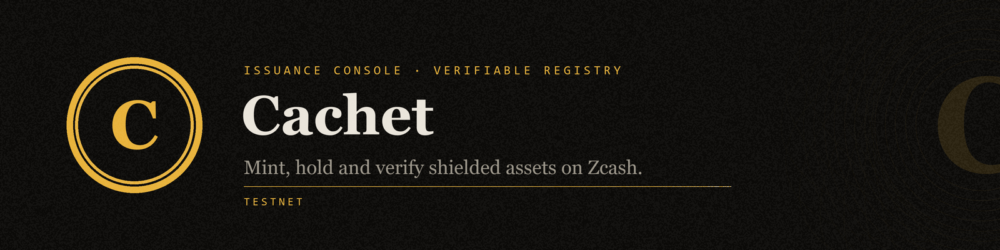

<p align="center">
  
</p>

# Cachet

**An issuance console and verifiable registry for Zcash Shielded Assets.**

[](https://github.com/cachet-zec/cachet/actions/workflows/ci.yml)
[](LICENSE)

Cachet is where ZSAs are born and verified: mint an asset with metadata
cryptographically sealed into its on-chain id, browse a registry that anyone
can audit, and let every visitor re-verify the metadata in their own browser —
while balances and transfers stay shielded, as Zcash intends.

**Live instance:** [cachetzec.com](https://cachetzec.com)
(public ZSA testnet, read-only + browser minting)

**Working paper:** [cachetzec.com/cachet-whitepaper.pdf](https://cachetzec.com/cachet-whitepaper.pdf)
(measured claims only, PDF in [docs/whitepaper](docs/whitepaper))

> **Honest scope.** ZSA (ZIPs 226/227) is not on Zcash mainnet: the v6
> transaction format was deferred out of NU7, and the protocol lives on a
> dedicated [public ZSA testnet](https://forum.zcashcommunity.com/t/zsa-testnet/56884)
> (since August 2026) and on local regtest. Cachet is therefore
> **production-grade engineering around a testnet-grade product**, built so it
> is ready the day the protocol ships. No mainnet claims are made.

## What it does

- **Mint** — name, supply, long description, image. Cachet builds a real v6
  OrchardZSA transaction (zero-knowledge proofs included) and commits it to
  the chain. Reissue until you **finalize**; then the supply is permanent.
  Batch minting (`POST /api/v1/assets/batch`) puts up to 16 assets in ONE
  issuance bundle — one transaction, one signature, all-or-nothing.
- **Seal** — the metadata bundle is stored content-addressed, and its SHA-256
  travels inside the on-chain asset description, which itself participates in
  the asset id (ZIP 227). Nobody — including the registry operator — can swap
  the name or image afterwards.
- **Verify** — every asset page re-fetches the bundle, re-hashes it with
  SubtleCrypto and compares against the on-chain commitment, client-side.
  Trust the math, not the registry.
- **Audit** — public per-asset history (mints, burns, finalization) with
  txids. Transfers are shielded and never appear: the registry shows exactly
  what the chain shows, nothing more.
- **Hold** — a wallet panel tracks the server accounts' spendable balances
  through trial decryption, incremental and cached.
- **Mint in your browser** — `/mint` generates a seed that never leaves the
  page, derives your own issuer identity, builds the transaction and its
  zero-knowledge proof in a Web Worker (the ZSA stack compiled to WASM),
  and hands the server nothing but signed bytes to relay. Works on the
  public read-only instance precisely because the instance signs nothing.
  Proving is threaded and the proving key is cached per session (a
  30-line vendored patch to zcash_primitives, see
  [server/vendor/librustzcash](server/vendor/librustzcash/README.md)):
  on cross-origin-isolated pages the worker proves over up to 8 wasm threads
  and warms the key while the user fills the form — a mint proves and
  signs in a measured 5.6 s, vs 43.4 s for the original single-core
  pipeline (7.7x). Falls back silently to single-core anywhere else.
- **Transfer & burn in your browser** — the same page scans the chain
  _locally_: raw blocks are public data identical for every caller
  (`GET /api/v1/chain/transactions`), and trial decryption, nullifier
  tracking and Merkle witnesses happen in the wasm module — the server
  never learns which notes are yours. Spend what you hold (transfer to
  any unified address, or burn), proof built in the page, relay only
  sees signed bytes.
- **Mirror it** — `GET /api/v1/snapshot` exports the whole registry as a
  deterministic payload sealed under the operator's Ed25519 key
  (`cachet-server --generate-snapshot-key`); any mirror can serve the
  file, any client can verify it — `python scripts/mirror.py` pulls the
  snapshot and every referenced bundle, re-hashing each one locally, so
  mirroring this registry never requires trusting it. Format +
  verification procedure in
  [packages/registry-spec](packages/registry-spec/README.md).
- **Moderate honestly** — an operator denylist (`cachet-server moderate`
  over SSH, or the token-gated `/admin` page when `CACHET_ADMIN_TOKEN`
  is set) can withhold a bundle, a description or a whole issuer
  (HTTP 410 `hidden-by-operator`, reason + timestamp, reversible) but can
  never alter one: metadata is content-addressed and verified
  client-side. A registry can withhold, it can never lie.
- **Resolve** — the chain stores only description _hashes_; anyone can teach
  the registry an asset's plaintext description, and it is accepted only if
  it hashes to the on-chain commitment (ZIP 227). Permissionless and
  unforgeable — the registry cannot be lied to. Foreign conventions are
  recognized end to end: ZMD-1 descriptors display under their canonical
  `slug #index` form, and full-form descriptors get their manifest
  fetched, BLAKE2b-verified against the on-chain commitment and rendered
  (`GET /api/v1/assets/{id}/zmd1-manifest`) — every name labeled by its
  provenance.
- **Publish** — `CACHET_READ_ONLY=1` turns an instance into a public,
  browse-and-verify deployment with every wallet-signing mutation
  disabled (HTTP 403). Description resolution (verification, not
  issuance) and metadata upload stay open: community mints seal full
  bundles — name, description, image — and a chain-anchored garbage
  collector sweeps any bundle that no resolved asset description
  references, so durable storage always costs a real zero-knowledge
  proof.

Works against a local OrchardZSA **regtest** (Docker) or the public **ZSA
testnet** (`CACHET_NETWORK=zsa-testnet`).

## Scope and non-goals

Cachet is **neutral issuance and verification infrastructure** for every
kind of ZSA — fungible tokens, tickets, editions, one-of-ones. It is
deliberately not a marketplace, and some lines are structural:

- **No custody, ever.** Cachet never holds a user's assets or funds, has no
  hosted-wallet phase and no escrow phase. The server wallet spends only
  the operator's own testnet notes.
- **No ownership database.** Holders, balances and transfers are shielded;
  Cachet does not track, mirror or attest who owns what — so there is no
  assignment registry to anchor, snapshot or lose.
- **No allowlists, no accounts, no social quests.** Reading, verifying and
  issuing all require nothing: anyone can mint from the browser on the
  public instance, under their own key. Only the operator's own wallet
  needs an instance of its own.
- **Derived data, plus the bundles themselves.** Postgres holds
  chain-derived state and the content-addressed bundles the chain commits
  to by hash. Integrity never depends on it — bundles are hash-verified
  client-side — only availability does (ADR-001, PRIVACY.md P4).

## Architecture

```
console/                 Next.js console: landing, mint studio, registry, asset pages
server/crates/domain     Pure business types — no chain, no I/O
server/crates/notes      Shared Orchard note tracking (server wallet + browser wallet)
server/crates/chain      The ONLY crate that touches the QED-it protocol forks
server/crates/index      Postgres: the chain-derived cache, plus what the chain cannot rebuild
server/crates/api        axum HTTP API, OpenAPI generated from code
server/crates/mint-engine  The browser engine: the ZSA stack compiled to WASM
server/crates/verify-engine  Asset-id derivation alone (no circuit): 247 KB wasm, loaded per asset page
packages/api-client      TypeScript client generated from the OpenAPI document
packages/registry-spec   The metadata format: on-chain envelope + content-addressed bundle
scripts/mirror.py        Mirror any registry, re-hashing every byte (no dependencies)
infra/                   docker-compose (regtest + Postgres), wasm engine build, prod deploy
docs/whitepaper          The working paper (generated PDF, measured claims only)
```

Two rules carry the design (see [docs/adr/001](docs/adr/001-architecture.md)):

1. **The chain boundary.** `cachet-chain` is the only crate allowed to depend
   on the alpha QED-it forks (orchard/librustzcash with ZSA support), pinned
   by exact git rev. When upstream breaks, one crate changes; the domain, the
   API contract, and the console do not.
2. **One source of truth per direction.** The chain is the source of truth
   for state — Postgres holds reconstructible derivations, plus the three
   tables it cannot rebuild (the description journal, the content-addressed
   bundles, and operator moderation). The Rust types are the source of truth
   for the API (OpenAPI and the TS client are generated, never hand-written).

## Quickstart

Prerequisites: Rust ≥ 1.86, Node 22 + pnpm, Docker.

```bash
# 1. Start the OrchardZSA regtest + Postgres (image build: see docs/SETUP.md)
docker compose -f infra/docker-compose.yml up -d

# 2. Run the server
cargo run --manifest-path server/Cargo.toml --bin cachet-server
# → API on http://localhost:8080, interactive docs at /api/docs

# 3. Run the console
pnpm install && pnpm dev
# → http://localhost:3000
```

To run against the public ZSA testnet instead, generate a private seed with
`cachet-server --generate-seed` and set `CACHET_NETWORK=zsa-testnet`,
`CACHET_SEED_PHRASE`, and `CACHET_SCAN_START_HEIGHT` — full walkthrough in
[docs/SETUP.md](docs/SETUP.md).

## Development

```bash
# Rust: format, lint (warnings are errors), test
cargo fmt --all && cargo clippy --workspace --all-targets -- -D warnings && cargo test

# Web: typecheck, lint, build
pnpm typecheck && pnpm lint && pnpm build

# Regenerate the TS client after changing the API
pnpm openapi:export && pnpm openapi:generate

# End-to-end: the full UI lifecycle against a real regtest chain
pnpm --filter @cachet/console e2e
```

CI runs all of the above on every push and pull request — including the
Playwright suite against a real OrchardZSA regtest node built from the
pinned QEDIT Zebra commit. See [CONTRIBUTING.md](CONTRIBUTING.md) before
opening a PR.

## Privacy

This project serves the Zcash community; privacy is a requirement, not a
feature. The console and server ship with **no telemetry, no analytics, no IP
logging**, strict CORS, `no-referrer` on outbound links, and no third-party
requests at runtime — the verifiable rules live in
[docs/PRIVACY.md](docs/PRIVACY.md).

## Security

This is alpha software built on alpha protocol dependencies. Do not use it
with value-bearing keys. To report a vulnerability, see
[SECURITY.md](SECURITY.md).

## Support

Cachet is free infrastructure for the Zcash ecosystem. If it is useful to
you, donations keep it running — shielded, of course:

```
u1rkcc55ajpuvwxlml7rnk9lx9gu54hzzyzr356n7czrtral9p2zdcw5sm3htj9pvrl2mzx036qkejt7pkjk90kvedk6x9nghdqxv892w4wqdtxmagxsj8pynu9pr9al540dx4jg9saekeea5dmafaa09fqvcdgptxffre68uxdsu674u8
```

## License

[MIT](LICENSE). Started by [0xPierre](https://x.com/0xPierre_com) and meant
to outgrow him: fork it, self-host it, take it further.

Bundled fonts (Fraunces, IBM Plex Mono — used to render the OpenGraph
image) are under the [SIL Open Font License](console/src/app/og-fonts/OFL.txt).
